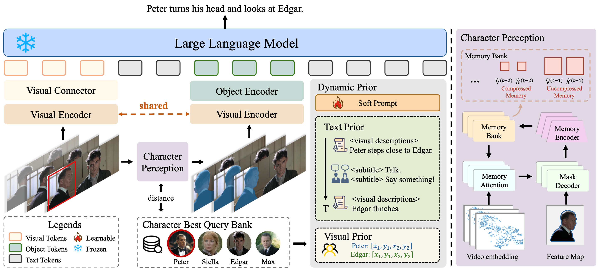
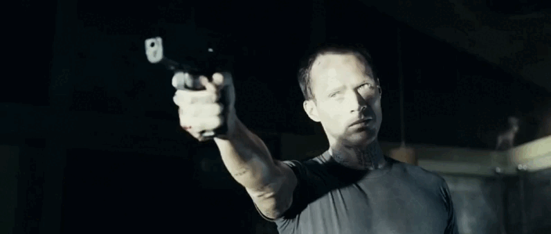
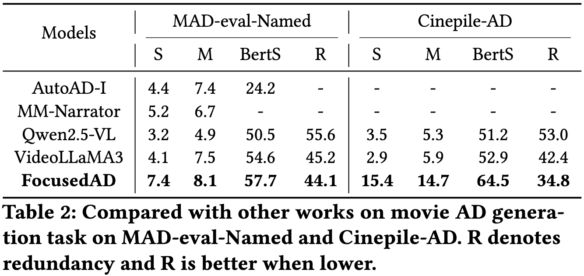

# FocusedAD: Character-centric Movie Audio Description
[](https://huggingface.co/datasets/Anonymous8976/FocusedAD-Datasets) 


## 😮 Highlights
We propose FocusedAD, a novel framework that delivers character-centric movie audio descriptions. It includes: (i) a Character Perception Module(CPM) for tracking character regions and linking them to names; (ii) a Dynamic Prior Module(DPM) that injects contextual cues from prior ADs and subtitles via learnable soft prompts; and (iii) a Focused Caption Module(FCM) that generates narrations enriched with plot-relevant details and named characters. 

<div align="center">
  
</div>

## Release Process
- [ ] FocusedAD model
  - [x] Release the checkpoint & code of FocusedAD
  - [ ] Provide gradio demo
  - [ ] Provide 🤗 Hugging Face demo
- [ ] Evaluation 
  - [x] Evaluation prompt & scripts
  - [ ] Evaluation outputs
- [ ] Dataset
  - [x] Character best query bank (train & test)
  - [ ] Storyboard-v2 (for train)
  - [ ] Cinepile-AD (for test)

## 🎥 Demo
<table>
 <tr>
  <td align="center" valign="center"></td><td align="center"></td>
 </tr>
 <tr>
  <td align="center"><font color=#335B96>Stella</font> takes a cigarette and puts it in her mouth.</td><td align="center"><font color=#C26224>Max</font> hugs <font color=#008000>Jack</font>, then turns and walks away.</td>
 </tr>
 <tr>
  <td align="center"></td><td align="center"></td>
 </tr>
 <tr>
  <td align="center"><font color=#335B96>GRAHAM</font> is sitting up in bed.</td><td align="center"><font color=#C26224>MICHAEL</font> is pointing a gun at <font color=#008000>SANDRA</font>.</td>
 </tr>
</table>

## 🚀 Main Results
We compare our method with previous audio description methods  on the MAD-eval-Named benchmark and Cinepile-AD and achieve **state-of-the-art** performance on both test datasets.
<div align="center">
  
</div>

## 🛠️ Installation
Basic Dependencies:
- Python >= 3.8
- Pytorch >= 2.2.0
- CUDA Version >= 11.8
- transformers == 4.40.0
- tokenizers == 0.19.1
```bash
pip install -r requirements.txt
pip install flash-attn==2.5.8 --no-build-isolation
pip install facenet-pytorch scikit-learn pandas numpy matplotlib
```

## 💡 Getting started

### CLI Inference
**Step2:** download [sam2.1_hiera_large.pt](https://dl.fbaipublicfiles.com/segment_anything_2/092824/sam2.1_hiera_large.pt) to `checkpoints`.

```bash
python infer.py
```


## 🗝️ Training & Evaluation

### Dataset
The dataset can be accessed on [huggingface](https://huggingface.co/datasets/Anonymous8976/FocusedAD-Datasets).


The detail of training & evaluation datasets is in [TRAIN_AND_EVAL.md](TRAIN_AND_EVAL.md).

### Metrics

**Classic Metrics**

Please refer to [ngl-eval](https://github.com/Maluuba/nlg-eval) for more details.

**Redundancy-aware Metric**

### Evaluation

**Prompt for Qwen2.5-VL & VideoLLaMA3:**

```
Please describe the video content in a simple, narrative style. Aim for about 3 words per second based on the video length. Use complete sentences with clear subject-verb or subject-verb-object structure. Keep the language natural and storytelling-oriented.
```

**Running command:**

```
# mad-eval-named evalation
bash scripts/eval/mad-eval-named.sh

# cinepile-ad evalation
bash scripts/eval/cinepile-ad.sh
```