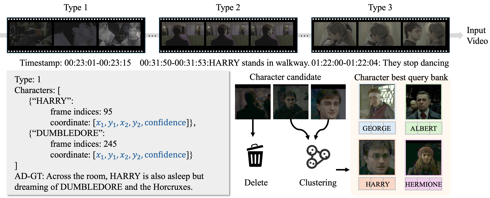

## 🖨️ Datasets
Let's say `$ROOT` is the root directory.
```
$ROOT
├── ...
└── datasets
    ├── test_mad_eval
    │   ├── json
    │   │   ├── tt0286106.json
    │   │   ├── ...
    │   │   └── tt1707386.json    
    │   ├── movie_clips
    │   │   ├── tt0286106
    │   │   │   ├── 1.mp4
    │   │   │   ├── ...
    │   │   │   └── 778.mp4
    │   │   ├── ...
    │   │   └── tt1707386  
    │   └── best_query
    │       ├── tt0286106
    │       │   ├── GRAHAM.npy
    │       │   ├── ...
    │       │   └── MORGAN.npy
    │       ├── ...
    │       └── tt1707386  
    ├── test_cinepile_ad
    │   ├── json
    │   │   ├── bXRv0TjJQZ0.json
    │   │   ├── ...
    │   │   └── xSyvjgWMsKc.json 
    │   ├── movie_clips
    │   │   ├── bXRv0TjJQZ0
    │   │   │   ├── 1.mp4
    │   │   │   ├── ...
    │   │   │   └── 4.mp4
    │   │   ├── ...
    │   │   └── xSyvjgWMsKc  
    │   └── best_query
    │       ├── bXRv0TjJQZ0
    │       │   ├── Peter.npy
    │       │   ├── ...
    │       │   └── Edgar.npy
    │       ├── ...
    │       └── xSyvjgWMsKc  
    └── train
        ├── json
        ├── movie_clips
        │   ├── tt0295297
        │   │   ├── 1006
        │   │   │   ├── 1.mp4
        │   │   │   ├── ...
        │   │   │   └── 10.mp4
        │   │   └── ...
        │   ├── ...
        │   └── tt02926084
        └── best_query
            ├── tt0295297
            │   ├── GRAHAM.npy
            │   ├── ...
            │   └── MORGAN.npy
            ├── ...
            └── tt02926084  
```

### Training Dataset

**Storyboard-v2**

Our constructed Storyboard-v2 comprises 11,250 triplets, each containing a no-dialogue movie clip, the corresponding best character query bank for that movie, and movie ad ground truth.
<div align="center">
  
</div>

Data format:
```
[
  {
    "movie_id": "tt0926084",
    "global_id": 1257,
    "type": 1,
    "resolution": [
      800,
      1920
    ],
    "main characters": [
      "HARRY",
      "DUMBLEDORE"
    ],
    "#characters": 2,
    "synopses": "Across the room, HARRY is also asleep but dreaming of DUMBLEDORE and the Horcruxes.",
    "movie_clips": "movie_clips/tt0926084/1257/5.mp4",
    "detect characters": [
      {
        "HARRY": [
          1106.6680908203125,
          32.062744140625,
          1573.136474609375,
          551.5222778320312,
          0.9951411485671997,
          95
        ]
      },
      {
        "DUMBLEDORE": [
          125.2412109375,
          60.8890380859375,
          374.2357177734375,
          384.423828125,
          0.7430102229118347,
          245
        ]
      }
    ]
  },   
  ...
  {
    "movie_id": "tt0926084",
    "global_id": 1110,
    "type": 2,
    "resolution": [
      800,
      1920
    ],
    "main characters": [
      "HARRY"
    ],
    "#characters": 1,
    "synopses": "HARRY stands in the covered walkway.",
    "movie_clips": "movie_clips/tt0926084/1110/4.mp4",
    "detect characters": []
  }, 
  ...
  {
    "movie_id": "tt0926084",
    "global_id": 1008,
    "type": 3,
    "resolution": [
      800,
      1920
    ],
    "main characters": [],
    "#characters": 0,
    "synopses": "They stop dancing.",
    "movie_clips": "movie_clips/tt0926084/1008/7.mp4",
    "detect characters": [
      {
        "HERMIONE": [
          664.4927368164062,
          223.05067443847656,
          1027.4920654296875,
          695.7171630859375,
          0.9805387258529663,
          0
        ],
        "HARRY": [
          522.6732177734375,
          181.7628784179688,
          873.184326171875,
          614.22900390625,
          0.9805387258529663,
          70
        ]
      }
    ]
  },
  ...
]
```

Preparation:

- Stage1: Prepare source movie files, please refer to  [storyboardv2_2_imdb.json](./datasets/train/storyboardv2_2_imdb.json)
- Stage2: Run `bash scripts/get_traindata.sh` to get movie clips.
- Stage3: put [json files](https://huggingface.co/datasets/Anonymous8976/FocusedAD-Datasets) into `datasets/train/json`


### Test Datasets

**MAD-eval-Named**

The evaluation data is derived from [MAD-eval-Named](https://www.robots.ox.ac.uk/~vgg/research/autoad/v1.html)

Data format:
```
[
    {
        "id": 1
        "movie": "1005_Signs",
        "imdb": "tt0286106",
        "movie_duration": 6391.2,
        "start": 126.568,
        "end": 130.799,
        "sentence": "A set of swings and a climbing frame stand in a rural backyard, along with a picnic table and a brick barbecue."
    },
    ...
]
```

**Cinepile-AD**

We collected 100 movie clip-AD based on cinepile benchmark pair.

Data format:
```
{
    "movie_name": "Asylum",
    "type": "narration",
    "movie_link_id": "bXRv0TjJQZ0",
    "narrations":[
        {
            "clip_id": "1",
            "content": "Peter steps close to Edgar."
        },
        ...
    ]
}
```
